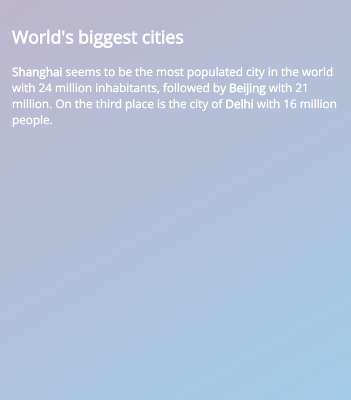
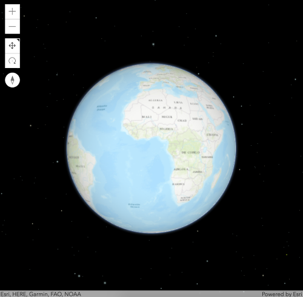
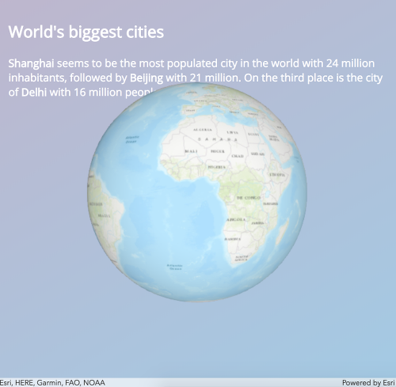
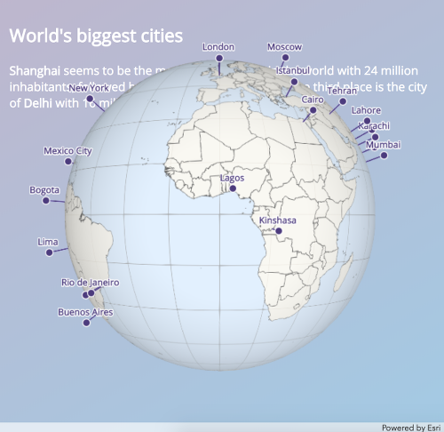

# World's biggest cities - how to build this app in 5 steps

The app in this folder shows the most populated cities in the world. This is a step by step tutorial on how to build this app and it's mostly destined at cartographers getting started with the web cartography :)


## Step 1

### - the one with the initial setup -

As usual with web things, it all starts with an `index.html` file where I import the API and I create the html for the app:

```html
<!DOCTYPE html>
<html>
<head>
  <meta charset="utf-8">
  <meta name="viewport" content="initial-scale=1">
  <title>World's biggest cities</title>
  <link rel="stylesheet" href="https://js.arcgis.com/4.8/esri/css/main.css">
  <link rel="stylesheet" href="custom.css">
  <script src="https://js.arcgis.com/4.8/"></script>
</head>

<body>
  <header>
    <div id="circle"></div>
    <div id="floating-text">
      <h2>World's biggest cities</h2>
      <p><span>Shanghai</span> seems to be the most populated city in the world with 24 million inhabitants,
        followed by <span>Beijing</span> with 21 million.
        On the third place is the city of <span>Delhi</span> with 16 million people. </p>
    </div>
  </header>
  <div id="view"></div>
</body>
</html>
```

I also load a custom css file with my own styles.
My styles format the header, the webscene view and add a nice gradient to the background of the html. I import a font from Google Fonts that I want to use it throughout the app.

```css
@import url('https://fonts.googleapis.com/css?family=Open+Sans');

html, body {
  padding: 0;
  margin: 0;
  height: 100%;
  width: 100%;
  /* fallback for browsers that don't support background gradients */
  background: #a2c9e5;
  background: linear-gradient(150deg, #beb5ce, #a2c9e5) no-repeat;
}

#view {
  height: 100%;
  width: 100%;
}

header {
  position: absolute;
  top: 0;
  right: 0;
  height: 100%;
  width: 100%;
}

#floating-text {
  font-size: 1.1em;
  text-align: left;
  padding: 20px;
  font-family: 'Open Sans', sans-serif;
  color: #ffffff;
}

span {
  font-weight: bold;
}
```

At the end of this step we have the background set up like this:



## Step 2

### - the one where we add the globe (with a module :sunglasses:) -

In this step we'll add the webscene with the globe visualization. We could create a new js file and load it in a script tag, but let's add it as a module instead. Dojo uses the AMD module system and it needs to know where to load the modules from, so we need to specify that in `dojoConfig`:

```html
<script>
  var dojoConfig = {
    // here we specify what modules/packages should be loaded
    packages: [{
      name: "app",
      // app is a folder that we'll create to host our own modules
      location: location.pathname.replace(/\/[^/]+$/, "") + "app"
    }],
    // loading packages asynchronously assures faster loading time
    async: true
  };
</script>
<!-- dojoConfig should be defined before loading the API -->
<script src="https://js.arcgis.com/4.8/"></script>
```

----
Sidenote:

This is all you need to know about the dojo module loader configuration, but in case you're interested you can read more about it [here](https://dojotoolkit.org/documentation/tutorials/1.10/dojo_config/index.html). I would rather encourage you to read more about JavaScript modules and their evolution. [This article](https://medium.freecodecamp.org/javascript-modules-a-beginner-s-guide-783f7d7a5fcc) is great in explaining the different ways of loading modules and how it came about to have so many different ways of importing modules in JavaScript.

----

Back on track: now we can create an `app` folder and add a `main.js` file where we'll write the code to add the globe. For this small app, a separate folder with a js file in it is a bit of an overkill, but as soon as your app will grow you can add more modules in the `app` folder.

Now in main.js we'll create a webscene and a view:

```js

// we use define instead of require when we create a module
define([
  "esri/WebScene",
  "esri/views/SceneView",
  "esri/layers/FeatureLayer",
  "esri/layers/support/LabelClass"
], function (WebScene, SceneView, FeatureLayer, LabelClass) {

  // the module exports an object with an init function
  // that creates the webscene and the view
  return {

    init() {

      // the webscene is the data model: it contains the basemap, the ground and the layers
      const webscene = new WebScene({
        basemap: "topo"
      });

      // the view is the visual representation of the webscene
      const view = new SceneView({
        container: "view",
        map: webscene
      });

      // setting the view as a global object is useful for debugging
      window.view = view;

    }
  }
});
```

One more thing before we start creating the webscene: we also need to import the module in our app, so in the html file add one more script before the closing body tag:

```html
<script>
  // this loads the module we are going to write
  require([
    "app/main",
    "dojo/domReady!"
  ], function(app) {
      app.init();
    });
</script>
```

And this is what our webscene currently looks like. I know what you're thinking: where is my nice background? :scream: Don't worry, we'll get it back in the next step.



## Step 3

### - the one where the globe gets stylish :nail_care: -

Ok, let's get rid of the realistic dark space behind our globe so that we can see the background. This all happens in the [environment](https://developers.arcgis.com/javascript/latest/api-reference/esri-views-SceneView.html#environment) of the view.

First we need to enable transparency on the view by setting [alphaCompositingEnabled](https://developers.arcgis.com/javascript/latest/api-reference/esri-views-SceneView.html#alphaCompositingEnabled) to `true`.

Next we want to set the background to be transparent. We also need to remove the stars (doesn't that sound cool? I can remove the stars :grin:) and the atmosphere:

```js
environment: {
  background: {
    type: "color",
    color: [0, 0, 0, 0]
  },
  starsEnabled: false,
  atmosphereEnabled: false
}
```

To remove the navigation widgets I usually just remove everything in the `view.ui` in the top left corner like this:

```js
view.ui.empty("top-left");
```

Allright, by now your code should look like this:

```js

const webscene = new WebScene({
  basemap: "topo"
});

const view = new SceneView({
  container: "view",
  map: webscene,
  alphaCompositingEnabled: true,
  environment: {
    background: {
      type: "color",
      color: [0, 0, 0, 0]
    },
    starsEnabled: false,
    atmosphereEnabled: false
  }
});

view.ui.empty("top-left");
```

So now if you check your app you should get something like this:



## Step 4

### - the one where we add data -

We want to display cities with the biggest population as points. We don't need a detailed basemap, we only need the borders of the countries.

So we'll remove the basemap and give the ground a blue color, like this:

```js
const webscene = new WebScene({
  basemap: null,
  ground: {
    surfaceColor: [226, 240, 255]
  }
});
```

Next, we need to add data. In the Living Atlas there's a dataset with generalized borders of the countries: https://www.arcgis.com/home/item.html?id=2b93b06dc0dc4e809d3c8db5cb96ba69

We'll load it as a FeatureLayer in our app and apply a different renderer to it:

```js
const countryBoundaries = new FeatureLayer({
  url: "http://services.arcgis.com/P3ePLMYs2RVChkJx/arcgis/rest/services/World_Countries_(Generalized)/FeatureServer",
  title: "World Countries",
  // we use a simple renderer when we want to symbolize all features with the same symbol
  renderer: {
    type: "simple",
    symbol: {
      type: "polygon-3d",
      symbolLayers: [{
        type: "fill",
        material: { color: [255, 250, 239, 0.8] },
        outline: {
          color: [70, 70, 70, 0.7]
        }
      }]
    }
  }
});

// then we add the layer to the webscene
// I use the addMany method because we'll add some more layers
webscene.addMany([countryBoundaries]);
```

Let's add the points for the cities as well. Again, there's an item in the Living Atlas with world cities as points: https://www.arcgis.com/home/item.html?id=6996f03a1b364dbab4008d99380370ed

I create another FeatureLayer and I only want to see the biggest cities, so I'm going to set a [definitionExpression](https://developers.arcgis.com/javascript/latest/api-reference/esri-layers-FeatureLayer.html#definitionExpression) to filter out cities that have a population under 6 million.

```js
const populationLayer = new FeatureLayer({
  url: "https://services.arcgis.com/P3ePLMYs2RVChkJx/arcgis/rest/services/World_Cities_analysis/FeatureServer",
  definitionExpression: "POP > 6000000"
});

// don't forget to add it to the webscene
webscene.addMany([countryBoundaries, populationLayer]);
```
To style the layer I still use a SimpleRenderer (all my points will look the same), but I'm going to spice up the 3D effect by lifting the points up vertically and connecting them to the original location using callouts.

The code looks like this:
```js
populationLayer.renderer: {
  type: "simple",
  symbol: {
    type: "point-3d",
    symbolLayers: [{
      type: "icon",
      size: 8,
      resource: { primitive: "circle" },
      material: { color: "#4c397f" },
      outline: {
        size: 1,
        color: "white"
      }
    }],
    verticalOffset: {
      screenLength: 20,
      minWorldLength: 20
    },
    callout: {
      type: "line", // autocasts as new LineCallout3D()
      size: 1.5,
      color: "#4c397f"
    }
  }
};
```
We also add labels using the font that we imported in the css file.
```js
populationLayer.labelingInfo = [
  new LabelClass({
    labelExpressionInfo: { expression: "$feature.CITY_NAME" },
    symbol: {
      type: "label-3d",
      symbolLayers: [{
        type: "text",
        material: { color: "#4c397f" },
        size: 10,
        font: {
          family: "Open Sans",
          weight: "bold"
        },
        halo: {
          color: "white",
          size: 1
        }
      }]
    }
  })
];
```

For a nicer globe effect we'll add a graticule. This is a layer that I generated using the [Create Fishnet](http://pro.arcgis.com/en/pro-app/tool-reference/data-management/create-fishnet.htm) tool in ArcGIS Pro.

```js
const graticule = new FeatureLayer({
  url: "https://services.arcgis.com/V6ZHFr6zdgNZuVG0/arcgis/rest/services/World_graticule_15deg/FeatureServer",
  opacity: 0.8
});
webscene.addMany([graticule, countryBoundaries, populationLayer]);
```
By now our map should look like this:



## Step 5

### - the one with the final touches -

Let's focus the camera on the cities that are most populated: Shanghai, Beijing and Delhi. What I usually do is to navigate to the position I find good as initial viewpoint and then print the camera to the console.

```js
camera: {
  position: {
    spatialReference: {
      wkid: 4326
    },
    x: 94.28248677690586,
    y: 21.553684553226123,
    z: 25000000
  },
  heading: 0,
  tilt: 0.12089379039103153
}
```

Most of the times the day time also needs some adjustment, so we'll specify the date in the `environment.lighting`:
```js
lighting: {
  date: "Sun Jul 15 2018 15:30:00 GMT+0900 (W. Europe Daylight Time)"
},
```

It doesn't make too much sense that the user zooms in too much, so we'll set an altitude constraint on the view:

```js
constraints: {
  altitude: {
    min: 18000000,
    max: 25000000
  }
}
```

Let's spice up that 3D effect with some shadows. Last week I discovered that [drop-shadow()](https://developer.mozilla.org/en-US/docs/Web/CSS/filter-function/drop-shadow) CSS filter works really nice with the transparency on the view. Such that my globe and all points/labels can nicely cast shadows. For this, add the filter on the view:

```css
#view {
  filter: drop-shadow(16px 16px 10px rgba(0,0,0, 0.5));
}
```

One more thing that you probably noticed in the beginning: we can't read the text. Let's make a trick to make it nicely wrap around the globe.

The trick goes like this: we add a `div` with a circle shape right about where the globe is located. Then we make the text float around it.

```css
#circle {
  height: 100%;
  width: 100%;
  shape-outside: circle(30%);
  float: right;
}
```

Unfortunately creating a circle div is only easy in Chrome, where `shape-outside` property is already implemented. For the rest of the browsers I added [this polyfill from Adobe](https://github.com/adobe-webplatform/css-shapes-polyfill).

And there we go, this is the final globe:

